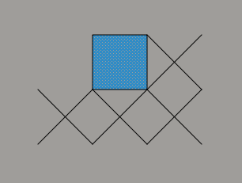

VOUW Project Journal
====================


## Amending the instance matrix data struture (updated 17-4-2019 )

In the current implementation the instance matrix is stored in a single array in lexicographical order. Traversing an array in order is usually very fast because of good locality and therefore lends itself quite well to the way we search for candidates and/or encode based on a given codetable. The problem is, however, that during candidate search we need to 'look around' the current instance in two dimensions. As we do not have this spatial information encoded in the array, we have to scan the array in the vicinity of the candidate instance. While this is still fast for small matrices, it becomes excessively slow when entire rows of the matrix do not fit in cache.

In light of the above issue and to accommodate for future improvements (flood-fill), I have expanded the array-based datastructure with a two-dimentional version of the instance matrix. I have picked a dictionary-of-keys representation for this, using std::unordered_map, however, future experiments may prove that other containers are better (options are: full-dense or CRS/CCS).

A dictionary-of-keys (theoretically) gives constant time access to any element we want to look up, which makes it potentially much faster to look in the neighborhood of an instance. The general search algorithm has to be changed to accommodate for this though. The current implementation uses the instance's bounding box to determine if another instance is adjacent. For the new implementation I introduce the concept of a pattern's 'periphery'. This periphery contains all indices in pattern-space of elements that are considered adjacent. I also distinguish between anterior and posterior periphery: elements that belong to instances that came either before or after in lexicographical order.

The periphery is constructed once for each pattern and uses the notion that each single element has 8 possible adjacencies. For the posterior periphery I have choosen the convention to use the W, SW, S and SE directions (north-east pointing towards (0,0), the see picture). This convention ensures that we see all combinations of instances just once. When the pattern-space coordinates from the periphery are transformed into (instance)matrix-space coordinates we can easily use the dictionary-of-keys to obtain the respective instances.



For the implementation I debated whether to use heap-allocation for the instances and store their pointers in both the instance vector and the dictionary-of-keys, or, allocate all instances in an array and only store indices. I denote these with (b) and (c) respectively, the old implementation is (a). In the table below I have listed three experiments with all three implementations.

| Test set              | Patterns | Iterations | Time          | Time per iteration |
|-----------------------|---------:|-----------:|--------------:| ------------------:|
| noisytriangles512  (a)|       24 |         27 |        11.9 s |                    |
| noisytriangles512  (b)|       24 |         31 |         1.8 s |                    |
| noisytriangles512  (c)|       24 |         31 |         1.6 s |                    |
| smileys512 (a)        |       18 |        982 |        21.5 s |                    |
| smileys512 (b)        |       24 |        967 |         1.8 s |                    |
| smileys512 (c)        |       24 |        974 |         2.2 s |                    |
| turing2048 (a)        |        ? |          ? |        ~60 h  | 4600 ms            |
| turing2048 (b)        |       31 |       5419 |        76 min | 846 ms             |
| turing2048 (c)        |       31 |       5044 |        60 min | 719 ms             |

For the smaller matrices the difference in performance is already quite noticeable. I had to create a new, larger example (turing2048, a 2048x2048 image) to outline the enormous difference in scaling behaviour. Furthermore it appears that the index-based implementation is slightly faster than the pointer-based version, which is not all that suprising as the pointer indirection is time-consuming and hinders some compiler optimizations (the difference is very small though!). 

## Encoding, current state of affairs (updated 8-4-2019)

In the current encoding schema I encode the model H (set of patterns) separately from the data given the model D|H (instance matrix Hbar) with two different coding schemes. The instance matrix is encoded using the prequential plug-in code (derivation in draft paper), while I use the universal prior and the uniform distribution for encoding the model. 

In order to make the computation of the prequential plug-in code as fast as possible, I have rearranged the formula in a way such that only simple logarithms of the gamma function remained. To compute this in the actual code I use LIBC's `lgamma()`, which I divide by `log(2)` in order to obtain the log2gamma. The actual equation then looks like this:

```
L( D|H ) =
    log2gamma( |Hbar| + epsilon * |H| ) - log2gamma( epsilon * |H| ) +
    [ -log2gamma( U(X) + epsilon ) + log2gamma( epsilon ) ] forall X in H
```

The model is computed fairly easily by first encoding the total number of patterns and then encoding each pattern.

```
L( H ) = L_N( |H| ) + L( X ) forall X in H
```

For each pattern we encode the string of elements plus the binomium of the total number of elements over the number of non-empty elements. This way we effectively enumerate all possible ways `|X|` non-empty elements can be distributed over the bounding-box of the pattern.

```
L( X ) =
    log2( M ) + log2( N ) + binom( width*height, |X| ) +
    log2( b-1 ) * |X|
```

Note how I changed the equation to use M and N (the dimensions of the input matrix) to uniformly encode the pattern's bounding box as opposed to using the universal prior (which may give undue penalty to larger patterns). Another change I made is that the last term (log2(b-1) * |X|) effectively disappears when the matrix is binary. This work in all cases because we treat one value as the empty value anyway.

Given this knowledge, the binomium term could also effectively be replaced by adding the empty value back to the uniform distribution. The length function for patterns would then look like this:

```
L( X ) =  log2( M ) + log2( N ) + log2( b ) * |X|
```

This change makes the algorithm continue slightly longer on small matrices, however, sparse patterns are not penalized in this way. Whether or not this is a problem remains to be seen. All in all the subjective quality of the results differ very little with either method as the algorithm still 'stops too soon'.

## (Re-)encoding with a given codetable (updated 4-3-2019)

When a dataset is encoded using a given codetable, certain decisions have to be made during this process. There is often more than one possiblity for 'fitting' patterns to a dataset and choices made here can affect the compression ratio dramatically. One example is that if patterns are greedily placed to cover a dataset, previously placed patterns might be 'in the way' of placing a (possibly better fitting) pattern at a location that would otherwise give a good description of the data.

The current commit of VOUW includes a simplistic encoding scheme that applies the mined codetable (again) to the same data. It thus regenerates the instance matrix from scratch with an existing codetable, let us call it 're-encoding'. Currently, I use an heuristic that first tries to fit the largest pattern in as many instances as possible, then the second-largest etc. This heuristic makes sense from a compression point-of-view, because large patterns reduce the size of the instance matrix. 

One of the ideas was to replace the algorithmic pattern/instance merging with a re-encode step each iteration. This would then hopefully prevent the small-pair-preference artifact to occur and would lead to a more repoducible result. Some simple tests indicated an (expected) performance degradation of a factor 100-500. However, the results did not benefit in the expected way. The small-pair-preference problem disappears in some instances, but not in others. The main reason for this is that the candidate search does not 'see' the possiblities that are created afterwards by the re-encoding step. 

Re-encoding might still be key to the encoding process, but perhaps not for every iteration. I did some tests with re-encoding after the normal algorithm has run its course (thus as a refinement step after encoding). I have tested this on the noisy_triangles example, of which I have also created larger version (with equal patterns and noise). As we had expected, the large versions encode marginally better, probably due to the fact that MDL works poorly on very small datasets.

| Test set              | Ratio   | Patterns | Iterations | Time          | Subjective quality |
|-----------------------|--------:|---------:|-----------:|--------------:| -------------------|
| noisytriangles64      | 96.7%   | 12       | 9          | 34 ms         | Mediocre           |
| noisytriangles64 *    | 96.6%   | 13       |            |               | Same as above      |
| noisytriangles256     | 98.0%   | 17       | 23         | 1531 ms       | Mediocre           |
| noisytriangles256 *   | 97.6%   | 14       |            |               | Slightly better    |
| noisytriangles512     | 97.6%   | 24       | 25         | 12469 ms      | Mediocre           |
| noisytriangles512 *   | 97.4%   | 18       |            |               | Much improved      |

The entries with * have been re-encoded as a refinement step. Note that due to the noisy nature of the tests, the compression ratio looks not very good, but the signal-to-noise ratio is actually quite impressive (we should develop an additional metric for this). We can clearly see that the re-encoded datasets improve in subjective clarity as well as the number of patterns needed to describe the dataset, whilst improving the ratio. 

## Status quo up to February 2019 (updated 24-2-2019)

In order to assess uncoming modifications, I decided to benchmark and report on the current sitution first. I will briefly decribe the components of the algorithm with their current implementation decisions.

- Candidate search. Lots of effort went into making this fast. Currently, we search for pairs *p1* and *p2* occuring in the instance list. Each pair is hashed so that we can quickly count multiple occurences as we go through the list. The main output of the candidate search is for all pairs *p1,p2* their current usage. One big problem is that if *p1=p2*, we can get all kinds of weird artifacts that lead to double counting. To combat this (and have exact gain computation) each time we count identical patterns, I compute their spatial configuration in what I call an *overlap coefficient*. This coeffecient is stored efficiently in a bitvector of the instance belonging to *p2*. When we later detect the same configuration in some instance belonging to a *p1*, we know we have already seen this thing shifted by one. Thus we ignore this occurence.
- Gain computation. In this step we compute gain for all candidates depending on their usage. Currently the computation is exact, so we need to do a lot of steps to get it right, because merging two patterns changes the entire codetable and all its codelengths. It is algebraically optimized such that little computations are needed and is therefore generally the fastest step.
- Merge the candidate. Here we simply merge the two patterns from the best candidate and replace all instances of the separate patterns with the same configuration, with the newly created pattern. This operation can account for a third of the computation time, depending on the usage of the new pattern. Effort decreases exponentially near the end because the instance matrix becomes much smaller.
- Pruning. Pruning can either be the pruning of zero-use patterns or the decomposition of used patterns. The latter is very complex and although it takes little time, it has not (yet) proven to be very usefull. 

### Shortcomings

The current approach is reasonably fast, but has several shortcomings. The most important are: (1) the encoded result during the process is not the same as when one would encode the input matrix with the same codetable from scratch, (2) there is no noise-rebustness and (3) an unwanted artifact occurs that leads to sub-optimal encodings that I call *small-pair preference.*

### Small-pair preference

This artifact is a result of taking shortcuts when merging the best candidate patterns. Say we have two strings of elements over the alphabet *1,2*:
```
1 2 1 2 1 2
1 2 1 2 1
```
We ignore the horizontal relation for a moment here. One would expect to find `1 2 1 2 1` twice along a lone `2` in the first string. However, we will in fact find five patterns `1 2` with a lone `1` in the second string. We could solve this problem by re-encoding the entire input matrix at every step. However, this would mean our gain computation is off as well as slow down each step considerably.

### Benchmark

These tests provide some insight into the current performance of the algorithm. These tests are not representative of any real-world problem nor are they particulary robust. I do hope they give some baseline to compare future solutions to. 

| Test set              | Ratio   | Patterns | Iterations | Time          | Subjective quality |
|-----------------------|--------:|---------:|-----------:|--------------:| -------------------|
| triangles32_32        | 43.14%  | 5        | 10         | 3 ms          | Excellent          |
| sonnet18              | 17.87%  | 41       | 258        | 1857 ms       | Good               |
| smileys512            | 8.586%  | 21       | 943        | 21505 ms      | Mediocre           | 
| rule73rand            | 39.64%  | 30       | 85         | 193 ms        | Excellent          |
| shapes40              | 31.82%  | 10       | 106        | 106 ms        | Good               |
| checkboard256         | 2.542%  | 3        | 16         | 401 ms        | Mediocre           |
| noise512              | -       | -        | -          | -             | Crash              |
| noisytriangles64      | 97.2%   | 14       | 7          | 23 ms         | Mediocre           |
| smallpair16           | 71.12%  | 6        | 9          | 2 ms          | Mediocre           |
| rulers32              | 93.64%  | 8        | 8          | 4 ms          | Mediocre           |

All tests were performed with 8 quantization levels and 'show progress' unchecked for unbiased timings. Note that the last three tests were especially crafted to make the current algorithm perform at its worst.
